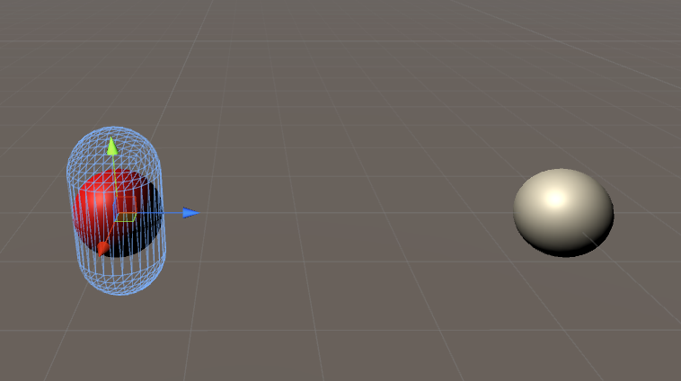

# What is this?
This is a project to reproduce a bug in Unity to do with dragging materials onto specific LOD levels of prefabs

This project contains a scene with two objects with a LOD group, one as a prefab instance, the other not as a prefab. Both LOD groups are set up with three different meshes; a cube for LOD0, a sphere for LOD1 and a capsule for LOD2.

# Repro steps
- Position the editor camera so both objects are in view, showing the sphere or cube (LOD1 or LOD0).
- Select LOD2 of the object 'TestObjectWithLOD_NotPrefab_Works' in the hierarchy.
- Drag TestMaterial from the project window onto the selected object in the 3D view.
- Select LOD2 of the object 'TestObjectWithLOD_Prefab_Broken' in the hierarchy.
- Drag TestMaterial from the project window onto the selected object in the 3D view.

# Expected behaviour?
I would expect the LOD2 renderer of both objects to have TestMaterial applied, and the other LOD levels to be unaffected.

# Actual behaviour
The non-prefab object is set up correctly. The prefab instance though, changes to whichever LOD level would currently be shown if a specific LOD object wasn't selected, and that object's material is set instead - i.e. either the cube or sphere. It's only set correctly if the camera is far enough away that the capsule would be shown.

Additionally, a wireframe of the currently selected object is shown, but the solid form of the incorrect LOD level is overlayed (see image).

This has been reproduced in Unity 5.3.4p5, and was known to be working with an older version of Unity 5; our artists can't remember which one but I estimate around 5.3.2.
